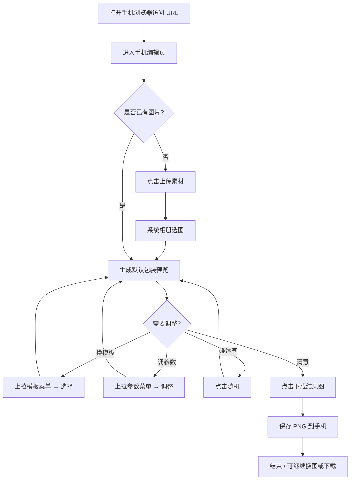
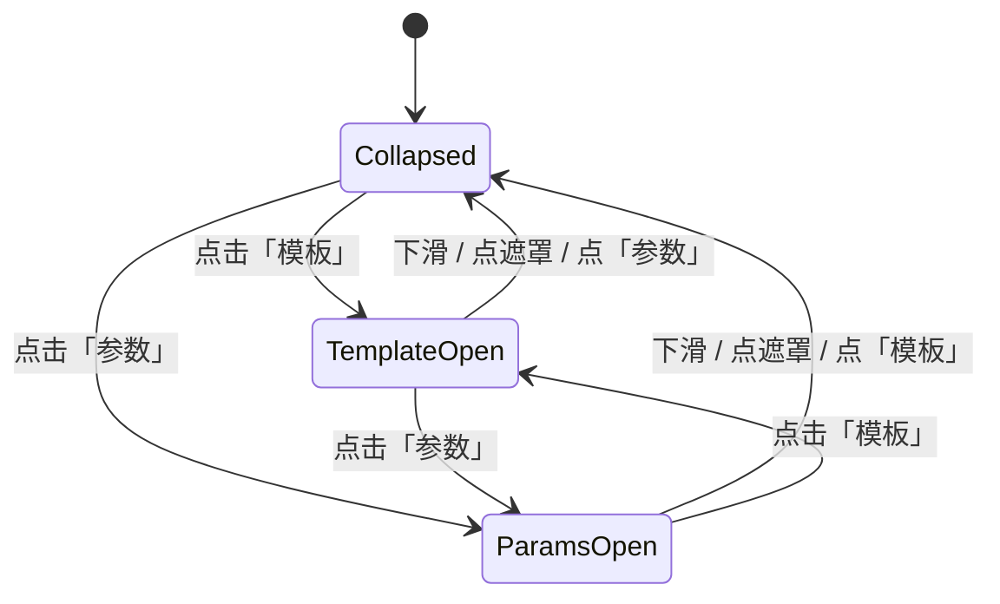

# FrameForge 手机版 MVP PRD

## 文档元信息

| 字段 | 内容 |
|---|---|
| 文档标题 | FrameForge 手机版 MVP PRD |
| PRD ID | BL-FF-001 |
| 类型 | A 基础型 |
| 版本 | V0.1 |
| 更新日期 | 2026-07-07 |
| 负责人 | 待补充 |
| 状态 | 起草中 |
| 优先级 | P0 |
| 排期 | MVP |

### 关联文档

| 文档 | 路径 | 用途 |
|---|---|---|
| 产品总览 PRD | `docs/PRD.md` | 产品定位、模板策略、桌面端能力边界 |
| 技术架构 | `docs/Architecture.md` | 前端栈、导出链路、存储方案 |
| 项目 README | `README.md` | 当前已实现能力与模板清单 |

### 需求概述

手机用户通过 iOS / Android 浏览器直接访问 FrameForge 网址，进入**仅含编辑能力**的精简页面：上传一张图片，在预览区查看包装效果，通过底部上拉菜单切换模板或调整参数，满意后下载 PNG 成品。**不保存画册、不进入首页、不支持视频**，追求「一次成型」的轻量体验。

---

## 1. 背景与目标

### 1.1 背景

桌面版 FrameForge 采用全站滚动结构（首页 Hero → 编辑器 → 模板画廊 → 画册），三栏编辑布局（模板侧栏 · 预览舞台 · 参数面板），并支持图片与视频的本地持久化。该形态适合桌面宽屏，但在手机端存在明显摩擦：

- 首页仪式、画廊、画册对「只想快速出一张图」的用户过重；
- 三栏横向布局在窄屏下不可用；
- 视频导出依赖 ffmpeg.wasm，移动端性能与兼容性风险高；
- 画册（IndexedDB 项目列表）对一次成型场景价值有限。

机会：复用现有编辑器内核（`CardPreview`、模板参数控件、Canvas PNG 导出），以较小改动提供移动端可用的「上传 → 微调 → 下载」闭环。

### 1.2 目标

| # | 目标 | 说明 |
|---|---|---|
| 1 | 移动端可用闭环 | 用户在手机浏览器完成「选图 → 预览 → 调参/换模板 → 下载 PNG」 |
| 2 | 极简信息架构 | 仅一个编辑页；无首页、无画廊、无画册入口 |
| 3 | 一次成型体验 | 会话结束即交付；不依赖本地项目保存与再次打开 |
| 4 | 复用桌面能力 | 模板渲染、参数逻辑、导出管线与桌面端共用，避免双份业务代码 |
| 5 | 控制实现成本 | 优先 CSS 断点 + Bottom Sheet 壳子，不做独立 App 或复杂手势库 |

---

## 2. 产品范围与用户路径

| # | 模式/路径 | 交互入口 | 用户行为 | 系统行为 | 输出结果 |
|---|---|---|---|---|---|
| 1 | 首次访问（无素材） | 手机浏览器打开站点 URL | 看到空预览区与底部操作栏 | 检测窄屏，渲染手机版编辑壳；不展示全站其他 Section | 可操作的编辑页 |
| 2 | 上传图片 | 「上传素材」按钮 | 从相册选择一张图片 | 读取 `File` → 创建内存项目 → 默认模板与参数 → 预览渲染 | 舞台区展示包装效果 |
| 3 | 换模板 | 底部「模板」入口 → 上拉菜单 | 点选模板名称 | 调用 `switchProjectTemplate`，刷新预览 | 预览更新 |
| 4 | 调参数 | 底部「参数」入口 → 上拉菜单 | 拖动滑杆、切换分段、编辑文字等 | 调用 `onUpdateTemplateParams`，实时刷新预览 | 预览更新 |
| 5 | 随机参数 | 「随机」按钮 | 一键随机 | 在当前模板安全范围内 shuffle | 预览更新 |
| 6 | 下载成品 | 「下载结果图」按钮 | 确认下载 | Canvas 渲染 PNG → 触发浏览器保存 | 用户获得 PNG 文件 |
| 7 | 替换素材 | 「上传素材」按钮（已有图时） | 重新选图 | 替换当前项目媒体，保留或重置参数（与桌面一致） | 预览更新 |

### 2.1 In Scope

- 手机断点下的独立编辑页布局（预览在上、操作在下）
- 模板选择 Bottom Sheet（上拉展开 / 下滑或点遮罩关闭）
- 参数编辑 Bottom Sheet（同上，与模板 Sheet 互斥）
- 预览区底部操作：**上传素材、随机、下载结果图**
- 图片上传（`image/*`）
- PNG 图片导出
- iOS Safari、Android Chrome 浏览器直接访问（HTTPS）

### 2.2 Out of Scope（非 MVP）

- 首页 Hero、Magic Frame 仪式动画
- 模板画廊 Section
- 画册（保存、重命名、打开历史项目）
- 视频上传、视频预览、视频导出
- 顶部四 Tab 全站导航（手机版可隐藏或极简化）
- 登录、云同步、分享链接
- 独立原生 App / PWA 安装引导
- Bottom Sheet 复杂多档位拖拽手势（MVP 可先做点击展开/收起）

---

## 3. 核心规则

| # | 规则项 | MVP 约定 | 备注 |
|---|---|---|---|
| 1 | 端侧识别 | `max-width: 768px`（或 `matchMedia` 等价断点）进入手机版壳 | 数值可在实现时微调，PRD 以 768px 为基准 |
| 2 | 页面结构 | 仅渲染编辑能力；不挂载 Hero / Gallery / Album Section | 桌面端布局与路由不受影响 |
| 3 | 素材类型 | 仅 `image/*`；拒绝 `video/*` | 上传控件 `accept="image/*"`；若用户强行选视频则 toast 提示 |
| 4 | 默认项目 | 上传后自动创建项目并套用默认模板（与桌面 `createProjectFromMedia` 一致） | 无首页 Magic Mode 仪式，参数可为规则默认 |
| 5 | 模板数量 | 复用现有 5 款模板（雾纱 / 格叙 / 空璃 / 沉璃 / 题序） | 与 `templateRegistry` 同步 |
| 6 | 参数能力 | 复用各模板现有 Inspector 控件，能力不减 | 仅容器从右侧栏改为 Bottom Sheet |
| 7 | 底部操作按钮 | **上传素材、随机、下载结果图** 三个必须保留 | 原桌面第四钮「保存至画册」手机版移除 |
| 8 | Sheet 互斥 | 同一时刻最多展开一个 Bottom Sheet | 打开「模板」时关闭「参数」，反之亦然 |
| 9 | Sheet 默认态 | 收起（collapsed）；仅显示拖拽条或入口按钮 | 保证预览区最大化 |
| 10 | 持久化 | 手机版 MVP **不写画册**；可不恢复 IndexedDB 上次会话 | 实现可选：跳过 `restoreLastSession` 或仅内存态 |
| 11 | 导出格式 | PNG；`scale: 1`（与桌面默认一致） | JPEG、多倍率导出为后续迭代 |
| 12 | 网络 | 部署于 HTTPS；纯前端，无后端依赖 | 字体 CDN 需可访问 |
| 13 | 桌面行为 | 宽度 > 断点时，完全保持现有桌面体验 | 手机 PRD 不改变桌面信息架构 |

---

## 4. 领域规则

| # | 规则类别 | 说明 |
|---|---|---|
| 1 | 模板切换 | 切换模板时保留项目 ID 与媒体，按 `switchProjectTemplate` 重置模板专属参数；与桌面逻辑一致 |
| 2 | 参数随机 | `shuffleProjectParams` 仅在当前模板安全范围内随机；按钮在无项目时禁用 |
| 3 | 系统取色 | 空璃 / 沉璃 / 题序等模板的「系统色」仍可在上传后异步采样；与桌面一致 |
| 4 | 预览缩放 | `CardPreview` 随容器宽度自适应；`aspect-ratio` 与 `clamp` 字号沿用现有实现 |
| 5 | 空状态 | 无素材时预览区展示简化上传引导（可复用 `EditorEmptyStage` 精简版），不跳转首页 |
| 6 | 替换素材 | 已有项目时再次上传执行 `replaceProjectMedia`，不新建画册记录 |

---

## 5. 用户交互流程

### 5.1 主流程：一次成型出图



| 步骤 | 用户 | 系统 |
|---|---|---|
| 1 | 浏览器打开站点 | 判断窄屏，展示手机编辑壳 |
| 2 | 点击「上传素材」 | 调起系统文件选择器（仅图片） |
| 3 | 选择图片 | 创建内存项目，渲染预览 |
| 4 | （可选）上拉「模板」菜单选模板 | 切换模板并刷新预览 |
| 5 | （可选）上拉「参数」菜单调参 | 实时更新预览 |
| 6 | （可选）点击「随机」 | 随机参数并刷新预览 |
| 7 | 点击「下载结果图」 | 导出 PNG 并触发下载/保存 |
| 8 | 离开页面 | 无画册要求；会话数据可丢弃 |

### 5.2 Bottom Sheet 交互



**MVP 确认策略：**

- Sheet 展开/收起以**点击入口 + 遮罩关闭**为主；拖拽手势为可降级项
- 选模板后可自动收起 Sheet（待决，见文末）
- 调参时 Sheet 可保持半开，便于边看预览边拖动滑杆

---

## 6. 原型示意

> 低保真结构说明，不代表最终视觉稿。

### 6.1 手机编辑页（Sheet 收起）

```
┌──────────────────────────────────┐
│ FrameForge（极简顶栏，可选）        │
├──────────────────────────────────┤
│                                  │
│         预览区（CardPreview）      │
│         占满剩余垂直空间           │
│                                  │
├──────────────────────────────────┤
│  [上传素材] [随机] [下载结果图]     │
├──────────────────────────────────┤
│  [  模板  ]    [  参数  ]         │  ← 两个 Sheet 入口
└──────────────────────────────────┘
```

### 6.2 模板 Bottom Sheet（展开）

```
┌──────────────────────────────────┐
│ ░░░░░░░ 半透明遮罩 ░░░░░░░░░░░░░ │
│ ┌──────────────────────────────┐ │
│ │  ───  拖拽条                  │ │
│ │  模板                         │ │
│ │  ○ 雾纱                       │ │
│ │  ○ 格叙                       │ │
│ │  ● 空璃  (当前)               │ │
│ │  ○ 沉璃                       │ │
│ │  ○ 题序                       │ │
│ └──────────────────────────────┘ │
└──────────────────────────────────┘
```

### 6.3 参数 Bottom Sheet（展开）

```
┌──────────────────────────────────┐
│ ░░░░░░░ 半透明遮罩 ░░░░░░░░░░░░░ │
│ ┌──────────────────────────────┐ │
│ │  ───  拖拽条                  │ │
│ │  Frame                        │ │
│ │  [画布比例] [滑杆] [文字] ...   │ │  ← 复用现有 *FrameControls
│ │  （内容可纵向滚动）            │ │
│ └──────────────────────────────┘ │
└──────────────────────────────────┘
```

### 6.4 空状态（无素材）

```
┌──────────────────────────────────┐
│         简化上传引导区             │
│    「上传一张图片，生成展示卡片」    │
│         [上传素材]                 │
├──────────────────────────────────┤
│  模板 / 参数入口禁用或弱化          │
└──────────────────────────────────┘
```

---

## 7. 错误与异常

| 场景 | 用户可见提示 | 系统行为 | MVP |
|---|---|---|---|
| 用户选择视频文件 | 「手机版仅支持图片」 | 阻断导入，不创建项目 | 是 |
| 图片读取失败 | 「素材读取失败」或具体错误信息 | Toast 提示，保持空状态 | 是 |
| 图片尺寸极大导致导出失败 | 「导出失败，请尝试较小尺寸的图片」 | Toast + 控制台记录 | 是 |
| 不支持的图片格式（如部分 HEIC 异常） | 「无法读取图片」 | 阻断并提示 | 是 |
| 无素材时点击下载 | 「请先上传素材后再下载」 | 按钮禁用或 Toast | 是 |
| 无项目时点击随机 | 按钮禁用 | 不触发 | 是 |
| iOS 下载未弹出文件保存 | 「请长按图片保存到相册」（fallback 文案） | 降级为打开 blob 预览页 | 可降级 |
| 网络字体加载失败 | 无阻断；预览回退系统字体 | 使用 `PingFang SC` 等 fallback | 可降级 |

---

## 8. 结果存放与展示

| 项 | 说明 |
|---|---|
| 存储位置 | **仅用户下载的 PNG** 保存在手机系统（相册 / 文件 / 下载目录）；应用内不持久化画册 |
| 展示入口 | 用户离开页面前仅在预览区查看；成品通过系统下载机制查看 |
| 组织方式 | 无应用内作品列表；文件名规则与桌面一致：`{项目名}.png`（sanitize 后） |
| 跨端同步 | 不支持 |
| IndexedDB | MVP 手机版可不写入 `projects`；若保留自动保存，仅作技术债，不对用户暴露 |

---

## 9. 质量标准与验收

### 9.1 性能与耗时验收

| # | 项目 | 条件 | 要求 | 口径 |
|---|---|---|---|---|
| 1 | 首屏可交互 | 4G 网络，中端 Android / iPhone 近 2 年机型 | 3 秒内可见编辑壳 | P90 |
| 2 | 上传至预览 | 500万像素以内 JPG | 2 秒内出现预览 | P90 |
| 3 | 参数调整反馈 | 拖动滑杆 | 预览 500ms 内跟随更新 | 必须 |
| 4 | PNG 导出 | 1080p 量级成图 | 8 秒内完成 | P90 |
| 5 | Sheet 展开动画 | 点击入口 | 300ms 内完成，无明显卡顿 | 必须 |

**不计入耗时的条件：** 用户选择超大原图（>20MP）、系统相册转码 HEIC、设备低电量降频。

### 9.2 质量验收

| # | 维度 | 验收方法 | 通过标准 |
|---|---|---|---|
| 1 | 功能闭环 | iOS Safari + Android Chrome 真机走主流程 | 上传、换模板、调参、随机、下载全通过 |
| 2 | 导出一致性 | 同图同参对比桌面 PNG | 视觉差异不可察觉（允许字体渲染微小差异） |
| 3 | 布局稳定 | 竖屏 320px～430px 宽度 | 预览不被 Sheet 永久遮挡；按钮可点 |
| 4 | 桌面无回归 | 宽度 ≥ 981px | 与现网桌面体验一致 |
| 5 | 视频隔离 | 手机端尝试上传 mp4 | 被拦截并提示 |

### 9.3 兼容性验收

| 平台 | 最低目标 |
|---|---|
| iOS Safari | iOS 15+ |
| Android Chrome | Android 10+ |
| 微信内置浏览器 | 待补充（建议 MVP 不承诺，见待决问题） |

---

## 10. 埋点

| 事件名 | 触发时机 | 关键属性 | MVP |
|---|---|---|---|
| `mobile_session_start` | 手机壳首次渲染 | `viewport_w`, `ua` | 可降级 |
| `mobile_upload_success` | 图片导入成功 | `template_id`, `file_size` | 可降级 |
| `mobile_template_change` | 模板切换 | `from`, `to` | 可降级 |
| `mobile_param_change` | 参数变更（可节流） | `template_id`, `field` | 否 |
| `mobile_shuffle` | 点击随机 | `template_id` | 可降级 |
| `mobile_export_success` | PNG 下载成功 | `template_id`, `duration_ms` | 可降级 |
| `mobile_export_fail` | 导出失败 | `error_code` | 可降级 |

> MVP 若无分析基建，埋点整节可延后，不影响功能上线。

---

## 11. 用户故事

| ID | 故事 | 验收要点 |
|---|---|---|
| US-001 | 作为手机用户，我想打开网址就能直接编辑，以便不必在首页和画册间跳转 | 窄屏仅见编辑页 |
| US-002 | 作为手机用户，我想从相册选一张图，以便快速看到包装效果 | 上传后预览正确 |
| US-003 | 作为手机用户，我想上拉菜单换模板，以便尝试不同风格 | 5 款模板可切换 |
| US-004 | 作为手机用户，我想上拉菜单调参数，以便微调边距、文字等 | 控件可用且预览更新 |
| US-005 | 作为手机用户，我想一键随机，以便碰运气获得更好效果 | 随机后预览变化 |
| US-006 | 作为手机用户，我想下载 PNG，以便发到社交平台 | iOS/Android 均可保存 |
| US-007 | 作为手机用户，我不需要保存到画册，以便用完即走 | 无画册入口与保存钮 |
| US-008 | 作为手机用户，我不应误传视频，以便预期清晰 | 视频被拦截并提示 |

---

## 12. 后续迭代 RoadMap

| 阶段 | 内容 | 依赖 |
|---|---|---|
| V1.1 | Bottom Sheet 拖拽手势 + 半屏/全屏 snap | MVP 壳子稳定 |
| V1.2 | 保存至画册（手机端只读打开） | 画册移动端 UI |
| V1.3 | 首页 Hero / Magic Frame 轻量接入 | 性能评估 |
| V1.4 | JPEG 导出、2x 导出 | 导出选项 UI |
| V2.0 | 视频上传与预览（不含导出或仅 WebM） | 性能与格式策略 |
| V2.1 | PWA 安装、离线缓存 | 部署配置 |

---

## 13. MVP 范围

### 13.1 MVP 必须

- 窄屏断点下仅展示手机编辑页
- 预览区 + 底部三按钮（上传、随机、下载）
- 模板 / 参数两个 Bottom Sheet（点击展开，互斥）
- 图片上传与 PNG 导出
- 复用现有 5 模板与 Inspector 控件
- 禁止视频上传
- iOS Safari、Android Chrome 真机验收通过

### 13.2 MVP 可降级 / 简化

- 顶部品牌栏可仅显示 Logo 文字，无全站导航
- Bottom Sheet 拖拽手势 → 先做点击切换
- 选模板后自动收起 Sheet
- iOS 下载 fallback（长按保存引导）
- 埋点全量 → 可暂不接入
- 跳过 IndexedDB 会话恢复
- `EditorEmptyStage` 不保留 Magic Frame 仪式，仅保留上传

### 13.3 MVP 明确不做

- 首页 Hero Section
- 模板画廊 Section
- 画册（保存、列表、重命名、删除）
- 「保存至画册」按钮
- 视频相关一切能力
- 登录注册、云同步
- 微信 / 抖音等 WebView 专项适配（除非另行立项）

---

## 实现参考（非需求，供研发对齐）

| 现有模块 | 手机版复用方式 |
|---|---|
| `EditorSection` | 增加 mobile 布局分支或拆 `MobileEditorSection` |
| `Sidebar` | 内容迁入「模板」Sheet |
| `Inspector` / `*FrameControls` | 内容迁入「参数」Sheet |
| `StageActionButton` | 保留 upload / random / download；移除 save |
| `App.tsx` | 窄屏不渲染 hero/gallery/album sections |
| `styles.css` | 新增 `@media (max-width: 768px)` 编辑页规则 |

**粗估工作量：** 1～1.5 人天（不含埋点与微信 WebView 适配）。

---

## 待决问题

| # | 问题 | 影响章节 | 建议决策人 |
|---|---|---|---|
| 1 | 选模板后是否自动收起 Sheet？ | §5.2、§6 | 产品 |
| 2 | 手机版是否完全跳过 IndexedDB 自动保存？ | §3、§8 | 研发 + 产品 |
| 3 | 顶栏是否保留 FrameForge 品牌与主题切换？ | §6 | 产品 |
| 4 | 是否承诺微信内置浏览器可用？ | §9.3 | 产品 |
| 5 | 断点用 768px 还是 980px（与现有 CSS 对齐）？ | §3 | 研发 |
| 6 | 空状态是否保留简化版 Magic Frame 一键生成？ | §4、§13 | 产品（当前倾向：否，纯上传） |
